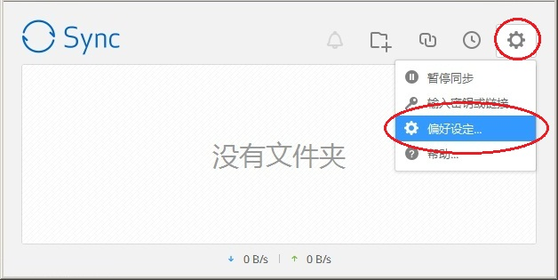
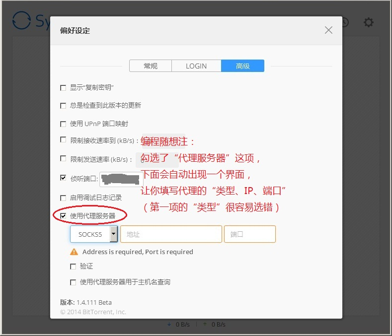
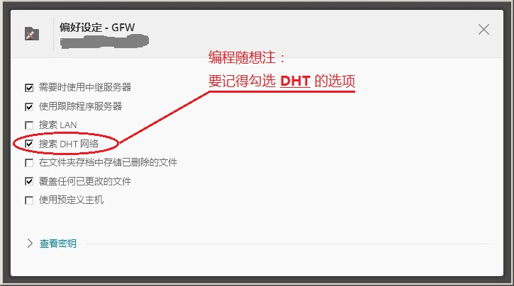
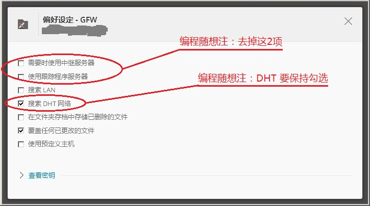
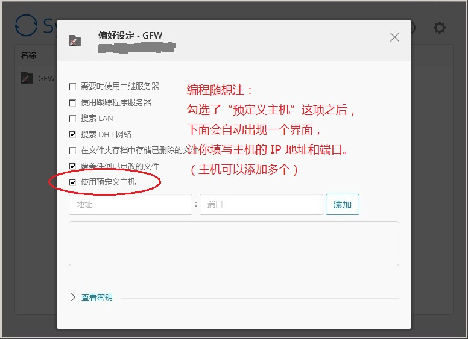

# 聊聊 GFW 如何封杀 Resilio Sync（BTSync）？以及如何【免翻墙】继续使用？

**文章目录\(本文中的链接可能需要翻墙访问\)**[★引子](file:///D:/log/btsyncfq.html#head-1)  
[★BTsync 如何实现【节点发现】？](file:///D:/log/btsyncfq.html#head-2)  
[★GFW 如何封杀 BTsync？](file:///D:/log/btsyncfq.html#head-3)  
[★为啥 GFW 难以封杀 DHT 网络？](file:///D:/log/btsyncfq.html#head-4)  
[★如何让你的 BTsync 客户端使用 DHT 网络？](file:///D:/log/btsyncfq.html#head-5)  
[★Q & A](file:///D:/log/btsyncfq.html#head-6)  
[★结尾](file:///D:/log/btsyncfq.html#head-7)  
 **备注：本文中往下出现的链接可能需要翻墙访问。**  


## ★引子

  
 　　最近一个多月，有好些读者抱怨 Resilio Sync（原名叫做“BitTorrent Sync”，简称“BTsync”）无法正常使用。所以俺一直打算写一篇来谈谈这个事情。顺便也分享一下：如何继续【免翻墙】使用 Resilio Sync。  
 　　（注：为了打字省力，本文以下部分使用“BTsync”来表示“Resilio Sync”。请原谅俺的懒惰）  
  
 　　如果你从来没有听说过 BTsync 这个玩意儿，建议先看看维基百科（[中文](https://zh.wikipedia.org/wiki/Resilio_Sync)，[洋文](https://en.wikipedia.org/wiki/Resilio_Sync)）。另外，还可以看看俺写的扫盲教程（[在这里](https://program-think.blogspot.com/2015/01/BitTorrent-Sync.html)）。  
 　　俺之所以大力普及该软件，关键在于：任何人都能用它来搭建一个【分布式】的网盘。关于【分布式】的重要性，俺已经唠叨过很多次了。对这个话题感兴趣的同学可以看下面这篇：  
 《[“对抗专制、捍卫自由”的 N 种技术力量](https://program-think.blogspot.com/2015/08/Technology-and-Freedom.html)》  
  
  


## ★BTsync 如何实现【节点发现】？

  
 　　为了聊今天的话题，需要先介绍一点点基础知识——BTsync 的“节点发现”机制。  
 　　大伙儿应该都知道：BT Sync 是一款点对点（P2P）的工具，用来进行文件共享和文件同步。对于任何一款 P2P 软件，其关键的机制是【节点发现】（洋文叫做“peer discovery”）。  
 　　BTsync 有两种完全不同的使用场景，分别是：局域网 和 公网。今天这篇只讨论 BTsync 在【公网】的使用。  
 　　BTsync 要想在【公网】上找到其它节点（peer），大致通过如下几招：  
  


### ◇Tracker Server（追踪服务器）

  
 　　BT 下载的老用户应该听说过 Tracker 这个概念。打个比方，Tracker Server 类似于节点（peer）之间的中介，互不认识的节点通过 Tracker Server 来获得对方的信息（IP 和端口）。  
 　　那么，BTsync 的客户端是如何知道 Tracker Server 的 IP 地址捏？通常有两种方法：  
 　　**方法1**  
 　　客户端软件本身已经内置了若干个 Tracker Server 的 IP 地址和端口。  
 　　**方法2**  
 　　客户端软件先连上 BTsync 公司官方的某个网站（通过域名的方式），然后得到某个配置文件，这个配置文件中会包含 Tracker Server 的 IP 地址和端口。比如下面这个网址，就是某些版本的 BTsync 用来获取配置文件的网址。  
 `https://config.resilio.com/sync.conf`  
  


### ◇DHT 网络

  
 　　DHT 是个啥玩意儿捏？这个说来话长，今天就不展开细谈了（此文发出后不久，俺又写了一篇 DHT 的扫盲：《[聊聊分布式散列表（DHT）的原理——以 Kademlia（Kad） 和 Chord 为例](https://program-think.blogspot.com/2017/09/Introduction-DHT-Kademlia-Chord.html)》）。  
 　　简而言之，你可以通俗的理解为：DHT 是用来弥补 Tracker Server 的局限性的。有了 DHT 这个机制，【不】需要依赖 Tracker Server 也可以做到【节点发现】。  
 　　当然啦，**【这是有前提滴】——你要先连上 DHT 网络的某个节点**。然后就可以通过你的第一个接入节点，逐步找到 DHT 网络中的其它节点，并且还能找到你想要获取的数据位于哪些节点。（这就好比你要想加入某个封闭的社团，先要得到社团中的某个人作为你的引荐人）  
 　　怎样找到 DHT 网络中的某个节点并与之建立连接，用技术行话称之为“bootstrap”。显然，bootstrap 是 DHT 的关键。  
 　　如果 BTsync 客户端支持 DHT 并启用了 DHT，客户端通常是先连接到 Tracker Server，然后就可以通过 Tracker Server 获得某个 DHT 网络的节点，于是就实现了 DHT 的 bootstrap。  
  


### ◇Predefined Hosts（预定义主机）

  
 　　所谓的“预定义主机”，说白了就是：用户自己在 BTsync 客户端的配置界面输入其它节点的 IP 和端口。  
 　　这个功能用得不多，但在某些情况下很有用。比如前面提到 DHT 的 bootstrap。在某些特殊环境中（比如墙内），你可以通过“预定义主机”这个功能添加某个 DHT 网络中的节点，然后你的 BTsync 客户端就可以实现 bootstrap 并加入到 DHT 中（关于这点，待会儿俺还会细聊）  
  


### ◇这几种方式的优缺点对比

  
 　　**Tracker Server（追踪服务器）**  
 　　这个机制最傻瓜化，完全无需用户干预。  
 　　但是这个机制也是【最容易被封杀】的。  
  
 　　**DHT 网络**  
 　　在没有“墙”的网络环境中，这个机制同样也是很傻瓜化的（客户端会自动通过 Tracker 找到 DHT 网络）  
 　　但如果是在【墙内】，Tracker 已经被屏蔽，需要手动实现 DHT 的 bootstrap（具体如何做，待会儿俺细聊）。  
 　　一旦实现了 bootstrap，DHT 很难被封杀。  
  
 　　**Predefined Hosts（预定义主机）**  
 　　这个机制的操作门槛最高。被 GFW 封锁的难度与 DHT 相当。  
 　　其门槛在于——你需要找到【IP 地址固定不变】的 BTsync 节点（至于如何找到这种节点，在本文后续部分会提及）  
  
  


## ★GFW 如何封杀 BTsync？

  
 　　看完上面的介绍，聪明的同学已经猜到 GFW 是如何封杀 BTsync 的。其实很简单，只要封锁 Tracker Server（追踪服务器）就可以让绝大部分客户端失效。因为绝大部分客户端都需要依赖 Tracker Server 来实现“节点发现”。  
 　　要封锁 Tracker Server，GFW 可以有两种方法：其一是“域名污染”，其二是“IP 黑名单”。（关于“域名污染”这个概念，可以参见俺之前的扫盲教程——《[扫盲 DNS 原理，兼谈“域名劫持”和“域名欺骗/域名污染”](https://program-think.blogspot.com/2014/01/dns.html)》。  
  
 　　刚开始的时候，GFW 采用“域名污染”的方式。所以网上也相应出现了一些文章，介绍若干招数，用来对抗域名污染，以便继续使用 BTsync。这些招数，无非就是：“修改 hosts 文件” 或 “加密 DNS 传输”。  
 　　说到这儿，俺要稍微泼点冷水。不论你是“修改 hosts”还是“用 dnscrypt 加密域名解析的传输”，都只能用来对付“域名污染”，但却【无法】对付“IP 黑名单”。由于 BTsync 官方提供的 Tracker Server，数量很有限（通常只有4个，2个是 IPv4，2个是 IPv6），而且这4个服务器的 IP 地址相对固定（不会经常变）。所以 GFW【很容易】就可以封掉这几个 IP 地址（简直可以说是“易如反掌”）。  
 　　那么，咋办捏？  
  
  


## ★为啥 GFW 难以封杀 DHT 网络？

  
 　　综上所述，要想让 BTsync 可以【免翻墙】使用，就不要再指望 Tracker Server 这种“节点发现”的机制了。因为这种机制太容易被封杀。  
 　　相比之下，GFW 要想封杀 DHT 就会困难得多（不是不可能，而是难度急剧增大）。为啥捏？主要有如下几个难点：  
  


### ◇难点1

  
 　　因为 BTsync 的 DHT 网络中会有很多节点，而且这些节点是【动态变化】的——每时每刻都有老的节点下线并且有新的节点上线。要想通过“IP 黑名单”的手段来屏蔽 DHT 网络中的所有节点，（对 GFW 维护人员来说）工作量会变得很大。  
  


### ◇难点2

  
 　　从技术上讲，GFW 的开发团队也可以做一些伪装成 BTsync 客户端的 agent，用这些 agent 来探测由 BTsync 客户端所构成的 DHT 网络中的节点信息。  
 　　但是，每个 DHT 节点并【不能】得到 DHT 网络中【所有节点】的信息，而只能得到其中一个很小的子集（只占整体的一小部分）。  
 　　所以，如果要用这招，GFW 开发团队需要构造足够多的 agent。（即便这样，这招也【无法解决】下面的第三个难点）  
  


### ◇难点3

  
 　　在 BTsync 的 DHT 网络中，有些节点位于【墙内】。GFW 对这些墙内节点是【无可奈何】的。因为 GFW 部属的位置在天朝公网的【国际出口】。通俗地说，GFW 只能屏蔽流经国际出口的流量。如果有两个节点【都在墙内】，那么这两个节点之间的流量是不会被 GFW 检测到的，GFW 也无法屏蔽这种【墙内流量】。  
  


### ◇补充说明

  
 　　虽然这个章节讲的是：BTsync 客户端构成的 DHT 网络。但其它形式的 DHT 网络，原理也是类似的，它们也会让 GFW 头疼。  
 　　如果你想对 DHT 有更多了解，请看：  
 《[聊聊分布式散列表（DHT）的原理——以 Kademlia（Kad） 和 Chord 为例](https://program-think.blogspot.com/2017/09/Introduction-DHT-Kademlia-Chord.html)》  
  
  


## ★如何让你的 BTsync 客户端使用 DHT 网络？

### ◇首先，要选择【正确的】客户端版本？

  
 　　刚才提到了 DHT 的重要性。对于 BTsync 而言，只有4个大版本支持 DHT，分别是：  


> 1.3.x（同步目录数无限制，但不支持“选择性同步”）  
>  1.4.x（同步目录数无限制，但不支持“选择性同步”）  
>  2.0.x（免费试用30天，30天之后如果不付费，最多只能同步10个目录）  
>  2.1.x（免费试用30天，30天之后如果不付费，最多只能同步10个目录）

　　如果你不需要“选择性同步”这个功能，就选 1.4.x 版本。  
 　　除非你极其需要“选择性同步”这个功能，才去选 2.1.x 版本，然后参考本文后续的【Q & A】章节，破解时间限制。  
 　　（本文后续部分的示意图会用 1.4.111 的界面进行截图，这个版本不仅是 1.4.x 的最后一个版本，也是 1.x.x 的最后一个版本）  
  
 　　根据某些读者反馈：**1.4.x 版本尚未被彻底封杀，可以【直接使用】**（提醒：在每个同步目录的“偏好设定”选项中，要记得勾选 DHT）。  
 　　虽然 1.4.x 目前是直接可用，但说不定过了几天就会出问题。所以大伙儿要重点阅读下面这个章节。  
  


### ◇如何加入到 DHT 网络？

  
 　　前面说了：接入 DHT 网络的关键是——找到 DHT 网络中的某个节点并与之建立连接（行话叫“bootstrap”）。下面要介绍的就是——如何在【墙内】实现 bootstrap。  
  
 　　**步骤1**  
 　　由于 GFW 封锁了官方的“追踪服务器”，你的客户端第一次运行时多半找不到任何 DHT 的节点。这时候你要先让 BTsync 走翻墙通道。  
 　　BTsync 翻墙可归纳为两种：其一是 VPN，其二是 proxy。（对于技术菜鸟，俺建议用 VPN，比较傻瓜化）  
 　　对于 VPN 方式：你需要在系统中运行 VPN 软件并正常连接到 VPN 服务器，然后在这个系统中运行 BTsync，BTsync 本身【无需】额外设置，就能自动通过 VPN 翻墙了。  
 　　对于 proxy 方式：你需要进入 BTsync 的“偏好设定”界面，找到 proxy 选项，正确填写。**设置完 proxy 要记得重启 BTsync。**  
  
  
 （在界面右上方的工具条，点击最右边那个按钮，打开菜单）  
  
 （在全局设置中填写代理的“类型、地址、端口”）  
 　　**步骤2**  
 　　添加一个同步目录的密钥（如何添加同步密钥，请参见[扫盲教程](https://program-think.blogspot.com/2015/01/BitTorrent-Sync.html)），然后设置这个新加目录。  
  
  
 （选中这个同步目录，点最右边那三个点的按钮，打开菜单，然后点“偏好设定”）  
  
  
 （要记得勾选【DHT】这项）　　等待一段时间（具体多长，视情况而定）。你要一直等，直到客户端界面上已经显示出若干节点数，并且已经开始进行同步。  
  
 　　**步骤3**  
 　　为了保险起见，你再次进入【每个同步目录】的“偏好设定”界面，【确保勾选 DHT】，同时把“追踪服务器”和“中继服务器”这2个选项【都去掉】。  
 　　**然后重启 BTsync。**等待它进入正常工作状态（找到其它节点并正常同步）。当它能正常工作，就说明 BTsync 已经基于 DHT 而【不再依赖】Tracker 了。  
  
  
 （去掉“中继服务器”和“追踪程序服务器”这2项，但要记得保留 DHT 这项）  
 　　**步骤4**  
 　　到了这最后一步，你可以把翻墙通道关掉，测试 BTsync 是否能【免翻墙】正常同步。  
 　　对于 VPN 翻墙，你只需要关闭/退出 VPN 软件，BTsync 不用重启；  
 　　对于 proxy 翻墙，你需要进入 BTsync【全局】的“偏好设定”界面，去掉所有 proxy 的设置（地址、端口），然后记得要【重启】BTsync（重启后，proxy 设置的改变才会生效）。  
  


### ◇如果你很久【没有】运行 BTsync，导致再也连不上 DHT，如何复活？

  
 　　BTsync 一旦接入了 DHT 网络，会把它得到的 DHT 网络的节点信息（地址、端口）保存在本地的某个文件中。那么当它下次启动的时候，就不用再费劲地去搞 bootstrap 了。  
 　　但是，假如你已经很长时间（比如超过一周）没有运行 BTsync，这时候本地保存的那些节点信息可能已经过时（请记住：DHT 网络的节点是在动态变化中的）。于是你的 BTsync 客户端又处于“脱离组织”的状态。这时候你需要再次重复前一个小节的那几个步骤，再来一次 bootstrap 操作流程。  
  


### ◇如何避免客户端脱离组织？

  
 　　刚才俺说了：如果你在墙内并且长时间没有运行 BTsync，那么将来再次启动 BTsync 会找不到 DHT 网络（脱离组织）。如何避免这种情况捏？俺简单介绍几招：  
  
 　　**招数1：经常运行/始终运行**  
 　　如果你是在 PC 上运行 BTsync，并且你的 PC 具备互联网的宽带接入。那么你干脆就让这个 BTsync 一直运行（提醒：在 BTsync 客户端上【至少添加一个】同步目录）  
 　　在这种状态下，你这个客户端始终是 DHT 网络这个组织的一份子，它可以持续得到 DHT 网络中节点变化的信息。这样就可以避免脱离组织。  
  
 　　**招数2：用“预定义主机”的方式添加固定节点**  
 　　要玩招数2，要求比较高，需要一个前提——你知道某个【地址/端口都相对固定】的 DHT 节点。  
 　　假设你知道了这种节点，那么你就可以进入【每个同步目录】的“偏好设定”界面，把这些 DHT 节点的“地址/端口”填写到“预定义主机”中。  
  
  
 （选中这个同步目录，点最右边那三个点的按钮，打开菜单，然后点“偏好设定”）  
  
 （勾选“使用预定义主机”，然后填写主机的“IP 地址、端口”）  
 　　完成上述设置后，客户端在每次运行时都会去找你添加的这几个节点，然后通过这些节点找到 DHT 网络的其它节点。  
 　　有的同学肯定要问了：这种“固定地址的 BTsync 节点”是怎么来的。  
 　　最直接的办法是：你自己买一个 VPS，并且这个 VPS 的地址【尚未】被 GFW 封杀。然后你在这个 VPS 上【长时间运行】BTsync，并且这个 BTsync 要记得使用 DHT 网络。那么这个 VPS 上的 BTsync 就会成为 DHT 网络中的一个稳定节点。然后你就可以让自己手机端或 PC 端的 BTsync 首先通过这个 VPS 节点进行 DHT 联网。  
 　　如果你自己懒得搭建 VPS，也可以通过你朋友或同事搭建的 VPS 来这么干。  
 　　再不济，你还可以去某些论坛或聊天群里面打听，或许也能了解到这种固定地址的 DHT 节点。  
  
  


## ★Q & A

  
 　　在文本结束前，补充一个问答时间。下面是一些经常被提及的问题。  
  


### ◇读者提问：为啥新版本的 BTsync（Resilio Sync）反而没有 DHT 功能？

  
 　　从前面的介绍中可以看出：早期版本是支持 DHT 的，从 2.2.x 开始就去掉了 DHT。  
 　　俺个人的猜测是（纯属个人猜测）：  
 　　BT 公司（BitTorrent, Inc.）是一直想通过 BTsync 来赚钱的。比如说：2.0 和 2.1 版本搞了一个“同步目录数限制”，用户要付费才能取消限制（这种伎俩引发众怒，所以官方被迫在 2.2.x 版本又去掉了限制）。再比如说：BT 公司后来剥离出一家 Resilio 公司单独运营 BTsync，并把 BTsync 重新包装成 Resilio Sync，这些也都是为了商业营销方面的考虑。  
 　　而去掉 DHT 的关键性在于——没有 DHT，所有的客户端都需要先连接到官方提供的 Tracker Server（追踪服务器）才能工作。这样一来，BT 官方（Resilio 公司）就可以对客户端软件具有【更多的控制力度】。  
 　　举个例子：从 2.2.x 开始的版本都需要依赖 Tracker Server。对这些版本的客户端，（从技术上讲）BT 公司有办法强迫它们升级版本（不升级就使之无法工作）  
  


### ◇读者提问：BT sync 会暴露公网 IP 吗？

  
 　　如果你的 BTsync 客户端【没有】通过代理或 VPN 的方式，而是直接联网，那么与你连接的其它节点【可能会】看到你的公网 IP。  
  


### ◇读者提问：对于电信运营商（ISP）或者公司网管，能监控到我的 BTsync 流量吗？

  
 　　BTsync 传输的数据是【强加密】的。所以，监控网络流量的人（Sniffer）最多只能猜测出你在用 BTsync，但是【无法知道】你正在同步的文件名和文件内容？  
  


### ◇读者提问：用 BT sync 同步翻墙工具会被跨省吗？

  
 　　维稳系统的人力（比如说网警）是有限的，他们的精力也是有限的。所以他们会重点搜捕敏感信息的【发布源头】（比如像俺这种大坏蛋）。对于【获取】敏感信息的普通网民，他们才没空搭理你。  
 　　以翻墙来举例：  
 　　六扇门（公安、国安）是不会去抓翻墙的网民（太多了，抓不过来，而且法不责众）。相比之下，网警会想办法去定位翻墙工具的作者。  
 　　对于 BT sync 也类似。如果你通过 BT sync【获取】敏感内容，六扇门才懒得理你；**但如果你通过 BT sync【发布】敏感内容，就要小心被六扇门的人盯上。**所以，俺作为 BT sync 的发布源，一直是采用【**基于 TOR 的多重代理**】来运行 BT sync。  
  


### ◇读者提问：（在不付费的情况下）如何去掉 2.1 和 2.2 的限制？

  
 　　（先声明：这招是网上看来的，俺【没】尝试过）  
 　　在安装前，先把系统时间调到若干年之后（比如2020年或2030年），然后再安装。  
 　　等到你用了超过30天，试用期结束了，你把系统事件调回正常的。这时候 BTsync 会以为还在试用期内。  
  


### ◇读者提问：为啥不用 [Syncthing](https://en.wikipedia.org/wiki/Syncthing) 来替代 BTsync 作为分布式网盘？

  
 　　首先俺承认：Syncthing 作为开源软件，在“开源”这点上明显好于闭源的 BTsync。  
 　　但是，Syncthing 的问题在于——更适合用于【私有分享】，而【不适合】用于【公有分享】。也就是说，你个人用它在多台设备之间同步，是没啥问题滴；但像俺这样用来搞一个面向成千上万网民的分布式网盘，Syncthing 就显得不合适了。  
  


### ◇读者提问：能否提供 BTsync 的校验码？

  
 　　先分享俺手头已有的 1.4.111 版本在各个平台下的软件包的哈希散列值（考虑到 MD5 和 SHA1 已经不够严密，下面使用【SHA256】）  
 　　（俺手头这几个软件包是当年从 BT 官网下载并保存至今）  


```text
483a8203d11053fe18f89bb4d95aaf97c4d6e4203a546d0f81efe19c5b221638  Windows/BTSync-1.4.111.exe
f3b3095d5b7021157ada032040144e715621585864e979ba53a4697be8918ae3  Linux/btsync_i386-1.4.111.tar.gz
6ea03cd2f60177baca58c701b80e1abf44b7c42fc4ec5b8bcfd3b266876e832f  Linux/btsync_x64-1.4.111.tar.gz
758cb2e3b21a21297a6fc46ca36999b2c7c170939b366e012af62a2ca953179c  Linux/btsync_glibc23_i386-1.4.111.tar.gz
921c47be0f60a3c88e8452a1de5252b2cbf1c8280d57a011f400d3cb9df676cc  Linux/btsync_glibc23_x64-1.4.111.tar.gz
1c7df900e4a64d7f349605b3406c183399fb09a6b96278ae04817e2fcce0acf4  MacOS/BTSync-1.4.111.dmg
c29133157b30ffbfb940a1c24da658779a35ed3e50b69c21b3d911a66434aa6f  Android/android-google-release-1.4.65.apk
```

## ★结尾

  
 　　今天先聊到这儿。关于本文介绍的这些，需要大伙儿多反馈，多分享经验。  
 　　与 GFW 斗争，需要群策群力。（套用我党的一句口号）**要让 GFW 陷入到人民战争的汪洋大海！**  
  
  
 **俺博客上，和本文相关的帖子（需翻墙）**：  
 [扫盲 BT Sync——不仅是同步利器，而且是【分布式】网盘](https://program-think.blogspot.com/2015/01/BitTorrent-Sync.html)  
 [聊聊分布式散列表（DHT）的原理——以 Kademlia（Kad） 和 Chord 为例](https://program-think.blogspot.com/2017/09/Introduction-DHT-Kademlia-Chord.html)  
 [“对抗专制、捍卫自由”的 N 种技术力量](https://program-think.blogspot.com/2015/08/Technology-and-Freedom.html)  
 [提供“博客离线浏览”和“电子书制作脚本”——用 BT Sync【免翻墙】自动同步](https://program-think.blogspot.com/2015/03/blog-sync.html)  
 [扫盲 DNS 原理，兼谈“域名劫持”和“域名欺骗/域名污染”](https://program-think.blogspot.com/2014/01/dns.html) **版权声明**  
本博客所有的原创文章，作者皆保留版权。转载必须包含本声明，保持本文完整，并以超链接形式注明作者[编程随想](mailto:program.think@gmail.com)和本文原始地址：  
 [https://program-think.blogspot.com/2017/08/GFW-Resilio-Sync.html](https://program-think.blogspot.com/2017/08/GFW-Resilio-Sync.html)

